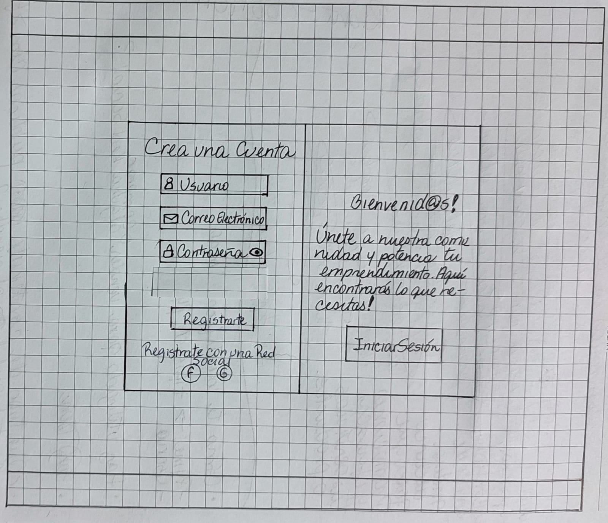
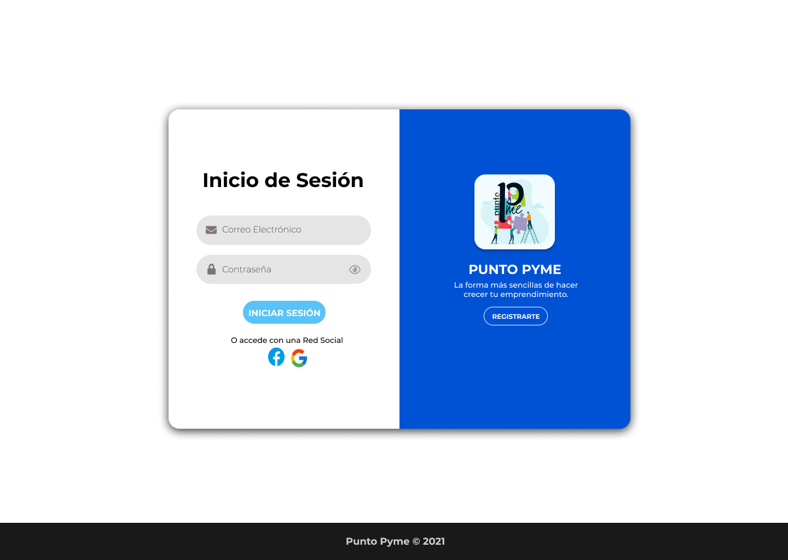
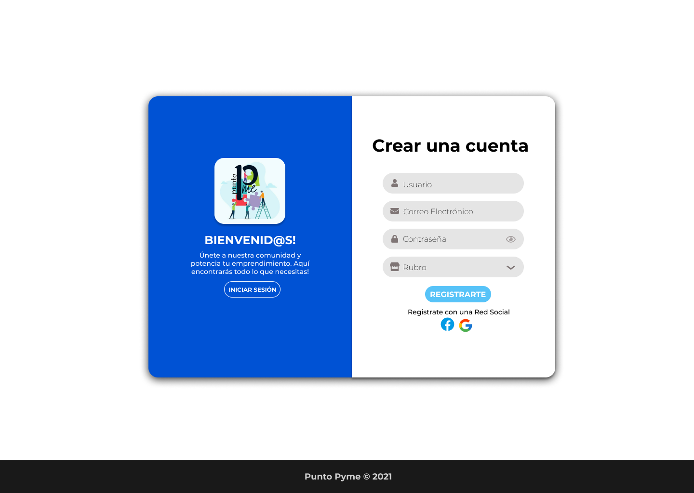
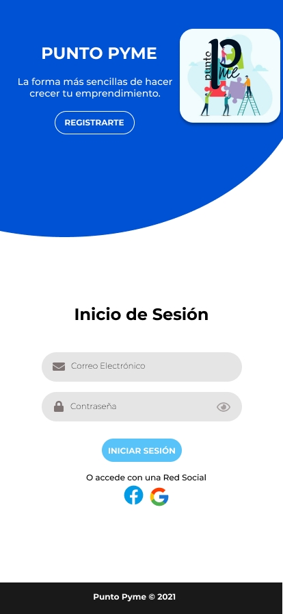

# Social Network

# PUNTO PYME

## Índice

* [1. Preámbulo](#1-preámbulo)
* [2. Descripción general](#2-descripción-general)
* [3. Perfil de usuarios](#2-perfil-de-usuarios)
* [4. Historias de usuarios](#3-historias-de-usuarios)
* [5. Prototipo y diseño](#4-prototipo-y-diseño)
* [6. Interfaz](#5-interfaz)
* [7. Modo de usuarios](#6-modo-de-usuarios)
* [8. Tecnología](#7-tecnología)
* [9. Enlace web](#8-enlace-web)

***
## 1. Preámbulo

Hoy todo está en las Redes Sociales, por lo que para las empresas es clave no sólo estar en línea, sino también tener presencia, y por supuesto, operar correctamente, a través de los canales de social media marketing.

Estudios de We Are Social indican que 3 de cada 4 chilenos son activos en redes sociales. De hecho, de acuerdo a cifras de Movistar Chile, un 94% de los usuarios utilizan apps como Facebook o un 75% utilizan Instagram.

 Las Redes Sociales ha revolucionado el mundo comercial, transformándose en el mejor aliado para mejorar la gestión de los emprendedores, de esta manera, las plataformas a las que se puede acceder a través de los diferentes tipos de dispositivos ayudan y potencian el crecimiento del negocio de forma acelerada en contraste de los resultados obtenidos con métodos tradicionales. 

 Debido al reciente suceso mundial de la Pandemia, la economía se desestabilizo dando paso a una era tecnológica que antes era opcional, convirtiendose actualmente una de las principales e indispensable forma de hacer negocio, a través de la internet, llegando ser pilar fundamental en el desarrollo y crecimiento de Pymes de una forma más rápida y accesible dandose a conocer sus respectivos productos y servicios, teniendo estos mayor alcance de usuarios a un costo asequible, ya sea a nivel local, nacional o internacional.

 Algunos tuvieron que partir de cero, otros debieron reducir su personal. Y ante la incertidumbre vieron una única solución: vender sus productos por internet y llevarlos hasta la puerta de las casas.

 Para ello, tuvieron que potenciar fuertemente las redes sociales, algo que ha sido el salvavidas para que microempresas sigan funcionando a lo largo del país. Una forma de vender que llegó para quedarse.

 Cada vez son más populares y atrayentes establecer negocios a través de las Redes Sociales, cada día se suman mas Pymes por una necesidad que la actualidad demanda, que es la cercanía a través de redes para sustentar y potenciar la economía a nivel local. Sin embargo, se tiene presente que hay pymes y pequeños negocios que corren con ciertas desventajas, porque todavía no cuentan con el conocimiento o las herramientas para transformar sus ventas al mundo digital.
## 2. Descripción general
Punto Pyme es una aplicación web gratuita, esta plataforma permite a toda Pyme potenciar su emprendimiento, independientemente de la etapa en que se encuentre. A través de un ámbito profesional y amigable, se busca crear una comunidad en línea para impulsar un compromiso al apoyar la economía local, en donde podran interactuar con sus clientes, y encontrar servicios o proveedores	para sus necesidades.

Respondiendo a esa invisibilidad y desventaja frente a las grandes compañias, es un gran apoyo para asi aprovecharse de las grandes ventajas que puede ocupar pertener a una Red Social como Punto Pyme, en donde juega un papel fundamental para darse a conocer al crear imagen de marca. Permiten atender más rápido y a más clientes a través de promociones efectivas, las cuales tendran un impacto e importancia en la venta. 
## 3. Perfil de usuarios
Punto Pyme va dirigido a todas las Pymes y usuarios que quieran fomentar la economía local, creando una comunidad en base a la sinergía y la unión de fuerzas, apoyandose en el poder de las Redes Sociales, con el objetivo de dar a conocer la marca, promocionar la compra/venta de servicios y/o productos a través de esta plataforma. Por lo tanto, entre los perfiles de usuario, destacan:
- Pymes: * 
  - Microempresa (<10 trabajadores).
  - Pequeña (<50 trabajadores).
  - Mediana (<250 trabajadores).
- Clientes.
*(Clasificación según el Ministerios de Economía Fomento y Turismo de Chile).

Una vez identificados dichos perfiles de usuarios, se procedio a realizar una encuesta como técnica de investigación con el objetivo de apreciar la experiencia y consideraciones de los mismos para determinar la necesidad de una Red Social centrada en las Pymes, a través de la encuesta se determino, que:

* El 39.1% se identifica como Pymes de tipo Microempresa, seguido por un 32.6% de Pymes Pequeñas y un 28.3% de Usuarios.
* Los rubros o áreas comerciales a las que pertenecen las Pymes o a las cuales los usuarios suelen comprar, predominan:
   - 21.7% Comercio al Por Mayor y al Por Menor.
   - 15.2% Otras actividades de Servicios.
   - 10.9% Transporte y Almacenamiento.
   - 10.9% Actividades de Alojamientos y de Servicios de Comidas. 
   - 8.7% Actividades Artísticas, de Entretenimiento y Recreativas.
   - 8.7% Industrias Manufactureras.
   
* El 97.8% han utilizado alguna Red Social para vender o comprar.
* 100%  conincide que publica con mayor frecuencia en su perfil al vender contenido de tipo texto con imágen.
* 100% como usuario valora en un perfil de compra/venta contenido de tipo texto con imágen.
* El 43.5% frecuentemente y un 30.4% muy frecuentemente vende por Redes Sociales. 
* El 45.7% frecuentemente y un 39.1% muy frecuentemente busca y compra productos por Redes Sociales.
* La recomendaciones son la interacción más valorada con un 47.8%, al momento de decidir una compra, seguida por los comentarios respondidos (45.7%), número de publicaciones (45.7%) y por último el número de likes (37%).
* El 50% le gusta comprar de forma on-line.
* Un 65.2% le suele comprar a Pymes o pequeños comerciantes.
* El 100% cree que las Pymes necesitan más áreas o espacios para darse a conocer.

## 4. Historias de usuarios
Historia de usuario 1: "yo, como pyme nueva quiero registrarme y crear una cuenta de forma sencilla para mostrar mis productos en una plataforma que sea amigable."

Criterios de aceptación:
- El usuario puede registrarse de forma sencilla y precisa.
- El usuario puede ingresar el nombre de la Pyme o usuario, email y contraseña.
- El usuario tendrá la opción de registrarse a través de su cuenta Google o Facebook en caso de tenerla, dichas cuentas deben ser válidas.
- El usuario recibirá un email de verificación de registro de cuenta.
- Se le garantizará al usuario su seguridad y privacidad a través de la aceptación de términos y condiciones legales.
- El usuario podrá iniciar sesión ingresando su email y contraseña creada.
- El usuario solamente puede iniciar sesión cuando sus credenciales (email y contraseña) son válidas.
- Tanto en el formulario de registro e inicio de sesión la contraseña al ser ingresada estará enmascarada.
- El usuario al ingresar su contraseña podrá tener la opción de hacerla visible.
- Todos los campos deberán ser rellenados por el usuario para su posterior validación.
- El registro e inicio de sesión puede hacerse fácilmente desde cualquier dispositivo.

Definición de terminado:
* [X] Definir prototipo de formulario de registro e inicio de sesión.
* [X] Definir y plasmar diseño interactivo.
* [X] En el formulario de registro crear campos de datos a través de input para ingresar: pyme/usuario, correo electrónico y contraseña.
* [X] Validación de nombre de usuario/pyme, no aceptar repeticiones.
* [X] Validación de correo electrónico por expresiones regulares.
* [X] Validación de contraseña, que cumpla criterios mínimos de seguridad.
* [X] Enmascarar contraseña.
* [X] Botón que permita hacer visible la contraseña.
* [X] Botones con iconos representativos de Facebook y Google para poder registrarse a través de las cuentas de esta plataforma.
* [X] Crear mensaje descriptivo emergete con instrucciones claras, en caso de que los datos no cumplan con la validación de los mismos.
* [X] Botón "Registrarte" para crear cuenta y acceder a la Social Network.
* [X] Apartado informativo de aceptación de términos y condiciones legales al registrarse.
* [X] Enlace con opción a Iniciar Sesión si se tiene una cuenta ya registrada.
* [X] En el formulario de Inicio de Sesión crear campos a través de input para ingresar: correo electrónico y contraseña.
* [X] Validar correo electrónicos y contraseña de usuarios ya registrados.
* [X] Enmascarar contraseña.
* [X] Botón que permita hacer visible la contraseña.
* [X] Botones con iconos representativos de Facebook y Google para poder iniciar sesión a través de las cuentas de esta plataforma.
* [X] Crear mensaje descriptivo emergete con instrucciones claras, en caso de que los datos no cumplan con la validación de los mismos.
* [X] Botón "Iniciar Sesión" para acceder a la Social Network.
* [X] Enlace con opción a Registarse si aun no se tiene una cuenta creada.
* [X] Autenticación y guardado de datos por Firebase.
* [X] Deben ser responsive.

Historia de usuario 2: "yo, como pyme establecida, quiero dar a conocer mis productos y servicios para aumentar mis ventas."

Criterios de aceptación:
- El usuario puede acceder a través de un menú a la opción de publicar un post.
- El usuario al acceder a la opción de publicar un post, accede a una plantilla que tendrá opciones para personalizar.
- El usuario en la plantilla del post tiene la opción de publicar Imágen, una breve descripción y/o rubro.
- El usuario puede dar por publicado el post a través de un botón de publicar.
- El usuario al visualizar el post publicado puede observar en la plantilla las siguientes descripciones: imágen, nombre de Pyme/Usuario, rubro, y/o breve descripción, likes, sección de comentarios.
- El usuario puede observar en su perfil los post publicados.
- El usuario puede editar los post publicados y preservar los cambios.
- El usuario puede eliminar los posts.
- El usuario puede confirmar si está seguro de eliminar o no un post a través de un mensaje de confirmación.
- El usuario puede interactuar con otros posts dandole like y comentando.
- El usuario puede quitar el like.

Definición de terminado:
* [X] Crear prototipo de baja fidelidad de la vista perfil y plantilla de publicación, para determinar la distribución de los elementos, siguiendo los fundamentos de mobile first.
* [X] Crear prototipo de alta fidelidad de la vista perfil y plantilla de publicación, para determinar diseño interactivo y amigable, siguiendo los fundamentos de mobile first.
* [X] Crear barra de navegación que contenga nombre de aplicación y menú con opción para publicar, acceder al perfil, acceder al muro y cerrar sesión.
* [X] La barra de navegación debe ser responsive siguiendo los fundamentos de mobile first.
* [X] Crear plantilla de publicación con la siguiente distribución: sección de imágen, nombre de Pyme/Usuario, breve descripción, likes(número de likes), sección de comentarios, botón de publicar, y botón de opción de editar y eliminar.
* [X] Publicar: cargar imágen en publicación y/o breve descripción y guardar.
* [X] Botón con opción de Editar y Eliminar publicación.
* [X] Al dar click para editar un post, debe cambiar el texto por un input que permita editar el texto y preservar los cambios.
* [X] Al guardar los cambios debe cambiar de vuelta a un texto normal pero con la información editada(botón guardar).
* [X] Eliminar posts, con mensaje de confirmación para ejecutar dicha acción.
* [X] Poder dar y quitar like a una publicación. Máximo uno por usuario.
* [X] Mostrar en publicación número interactivo real de likes.
* [X] Poder comentar publicaciones. 
* [X] Mostrar post en perfil.

Historia de usuario 3: "yo, como pyme grande quiero buscar otras pymes que vendan insumos y materia prima de mi interés para potenciarnos mutuamente."

Criterios de aceptación:

Definición de terminado:

## 5. Prototipo y diseño

- Diseño de baja fidelidad

-Diseño de alta fidelidad

## 6. Interfaz

## 7. Modo de usuarios

## 8. Tecnología

## 9. Enlace web

***

# Creando una Red Social

## Índice

* [1. Preámbulo](#1-preámbulo)
* [2. Resumen del proyecto](#2-resumen-del-proyecto)
* [3. Objetivos de aprendizaje](#3-objetivos-de-aprendizaje)
* [4. Consideraciones generales](#4-consideraciones-generales)
* [5. Criterios de aceptación mínimos del proyecto](#5-criterios-de-aceptación-mínimos-del-proyecto)
* [6. Hacker edition](#6-hacker-edition)
* [7. Entrega](#7-entrega)
* [8. Pistas, tips y lecturas complementarias](#8-pistas-tips-y-lecturas-complementarias)

## 1. Preámbulo

Instagram, Snapchat, Twitter, Facebook, Twitch, Linkedin, etc. Las redes
sociales han invadido nuestras vidas. Las amamos u odiamos, y muchos no podemos
vivir sin ellas.

Hay redes sociales de todo tipo y para todo tipo de intereses. Por ejemplo,
en una ronda de financiamiento con inversionistas, se presentó una red social
para químicos en la que los usuarios podían publicar artículos sobre sus
investigaciones, comentar en los artículos de sus colegas, y filtrar artículos
de acuerdo a determinadas etiquetas o su popularidad, lo más reciente, o lo
más comentado.

## 2. Resumen del proyecto

En este proyecto construirás una Red Social sobre lo que decidan tú y tu equipo.
Podría ser, por ejemplo, sobre alimentación saludable, feminismo, educación,
salud, energías renovables, amantes de las [Empanadas](https://es.wikipedia.org/wiki/Empanada)
o de los [Tacos de Canasta](https://es.wikipedia.org/wiki/Taco), de la
[Feijoada](https://es.wikipedia.org/wiki/Feijoada), o de lo que sea.

Tu Red Social tendrá que permitir a cualquier usuario crear una cuenta de
acceso y loguearse con ella; crear, editar, borrar y _"likear"_ publicacciones.

## 3. Objetivos de aprendizaje

El objetivo principal de aprendizaje de este proyecto es construir una
[Single-page Application (SPA)](https://es.wikipedia.org/wiki/Single-page_application)
[_responsive_](../../topics/css/02-responsive) (con más de una vista / página)
en la que podamos **leer y escribir datos.**

### HTML y CSS

* [ ] [Uso de HTML semántico.](https://developer.mozilla.org/en-US/docs/Glossary/Semantics#Semantics_in_HTML)
* [ ] Uso de selectores de CSS.
* [ ] [Uso de flexbox en CSS.](https://css-tricks.com/snippets/css/a-guide-to-flexbox/)
* [ ] [Uso de CSS Grid Layout](https://css-tricks.com/snippets/css/complete-guide-grid/)

### DOM y Web APIs

* [ ] Uso de selectores del DOM.
* [ ] Manejo de eventos del DOM (addEventListener, removeEventListener,
Event objeto, delegación de eventos)
* [ ] [Manipulación dinámica del DOM](
  https://developer.mozilla.org/es/docs/Referencia_DOM_de_Gecko/Introducci%C3%B3n)
(appendChild | createElement | createTextNode | innerHTML | textContent | etc.)
* [ ] Implementación de routing ([History API.](
  https://developer.mozilla.org/es/docs/DOM/Manipulando_el_historial_del_navegador
  ) | `hashchange`)

### JavaScript

* [ ] Uso de condicionales (if-else | switch | operador ternario)
* [ ] Uso de funciones (parámetros | argumentos | valor de retorno)
* [ ] Manipular arrays (filter | map | sort | reduce)
* [ ] Manipular objects (key | value)
* [ ] Uso ES modules ([`import`](https://developer.mozilla.org/en-US/docs/Web/JavaScript/Reference/Statements/import)
| [`export`](https://developer.mozilla.org/en-US/docs/Web/JavaScript/Reference/Statements/export))
* [ ] Diferenciar entre expression y statements.
* [ ] Diferenciar entre tipos de datos atómicos y estructurados.
* [ ] [Uso de callbacks.](https://developer.mozilla.org/es/docs/Glossary/Callback_function)
* [ ] [Consumo de Promesas.](https://scotch.io/tutorials/javascript-promises-for-dummies#toc-consuming-promises)

### Testing

* [ ] [Testeo unitario.](https://jestjs.io/docs/es-ES/getting-started)
* [ ] [Testeo asíncrono.](https://jestjs.io/docs/es-ES/asynchronous)
* [ ] [Uso de librerias de Mock.](https://jestjs.io/docs/es-ES/manual-mocks)

### Estructura del código y guía de estilo

* [ ] Organizar y dividir el código en módulos (Modularización)
* [ ] Uso de identificadores descriptivos (Nomenclatura | Semántica)
* [ ] Uso de linter (ESLINT)

### Git y Github

* [ ] Uso de comandos de git (add | commit | pull | status | push)
* [ ] Manejo de repositorios de GitHub (clone | fork | gh-pages)
* [ ] Colaboración en Github (branches | pull requests | |tags)
* [ ] Organización en Github (projects | issues | labels | milestones)

### Firebase

* [ ] [Firestore.](https://firebase.google.com/docs/firestore)
* [ ] [Firebase Auth.](https://firebase.google.com/docs/auth/web/start)
* [ ] [Firebase security rules.](https://firebase.google.com/docs/rules)
* [ ] Observadores. ([onAuthStateChanged](https://firebase.google.com/docs/auth/web/manage-users?hl=es#get_the_currently_signed-in_user)
 | [onSnapshot](https://firebase.google.com/docs/firestore/query-data/listen#listen_to_multiple_documents_in_a_collection))

### UX

* [ ] Diseñar la aplicación pensando y entendiendo al usuario.
* [ ] Crear prototipos para obtener feedback e iterar.
* [ ] Aplicar los principios de diseño visual (contraste, alineación, jerarquía)
* [ ] Planear y ejecutar tests de usabilidad.

## 4. Consideraciones generales

* Este proyecto se debe trabajar en equipos de tres.

* La lógica del proyecto debe estar implementada completamente en JavaScript
  (ES6+), HTML y CSS :smiley:. Para este proyecto **no está permitido** utilizar
  _frameworks_ o librerías de CSS y JS.

* La división y organización del trabajo debe permitir, sin excepciones, que
  **cada integrante** del equipo practique el aprendizaje de todo lo involucrado
  en **cada historia**. _No se dividan el trabajo como en una fábrica._
  - ¿Hasta acá has avanzado en tus proyectos con cierta fluidez y sin mayores
    problemas? Sé generosa con tus compañeras, permíteles aprender y practicar
    sin restricciones, aunque tome un poco más de tiempo. Aproveha de
    _coachearlas_, de hacer _pair programming_, una de las mejores maneras de
    aprender es explicando verbalmente.

  - ¿Se te está haciendo difícil y te cuesta un poco más avanzar? No te quedes
    con las partes "fáciles" del proyecto, conversa, negocia, exige tu oportunidad
    para practicar y aprender lo que se te hace más difícil.

* Solamente pueden trabajar en una única historia por vez, no pueden avanzar a
  la siguiente sin haber completado la anterior. La historia se completa cuando
  se cumplen **todos** sus Criterios de Aceptación + **toda** su Definición
  de Terminado.

Para comenzar tendrás que hacer un _fork_ y _clonar_ este repositorio.

## 5. Criterios de aceptación mínimos del proyecto

### 5.1 Boilerplate

Este proyecto no incluye un _boilerplate_, así es que tendrás que definir la
estructura de carpetas y escribir tus propias Pruebas Unitarias (_tests_). Para
hacerlo, puedes guiarte de los proyectos anteriores.

### 5.2 Definición del producto

En el `README.md` cuéntanos brevemente cómo descubriste las necesidades de los
usuarios y cómo llegaste a la definición final de tu producto. Es importante
que detalles:

* Quiénes son los principales usuarios de producto.
* Qué problema resuelve el producto / para qué le servirá a estos usuarios.

### 5.3 Historias de usuario

Una vez que entiendas las necesidades de tus usuarixs, escribe las Historias de
Usuario que representen todo lo que necesitan hacer/ver en la Red Social. Cada
una de tus Historias de Usuario debe tener:

* **Criterios de Aceptación:** todo lo que debe ocurrir para satisfacer las
  necesidades del usuario.

* **Definición de terminado:** todos los aspectos técnicos que deben cumplirse
  para que, como equipo, sepan que esa historia está terminada y lista
  para publicarse. **Todas** tus Historias de Usuario (salvo excepciones), deben
  incluir estos aspectos en su Definición de Terminado (más todo lo que
  necesiten agregar):

  - Debe ser una SPA.
  - Debe ser _responsive_.
  - Deben haber recibido _code review_ de al menos una compañera de otro equipo.
  - Hicieron los _test_ unitarios
  - Testearon manualmente buscando errores e imperfecciones simples.
  - Hicieron _pruebas_ de usabilidad e incorporaron el _feedback_ de los
    usuarios como mejoras.
  - Desplegaron su aplicación y etiquetaron la versión (git tag).

### 5.4 Diseño de la Interfaz de Usuario (prototipo de baja fidelidad)

Debes definir cuál será el flujo que seguirá el usuario dentro de tu aplicación
y, con eso, diseña la Interfaz de Usuario (UI por sus siglas en inglés) que
siga este flujo.

### 5.5 Responsive

Debe verse bien en dispositivos de pantallas grandes
(computadoras/es, laptops, etc.) y pequeñas (_tablets_, celulares, etc.). Te
sugerimos seguir la técnica de _`mobile first`_ (más detalles sobre esta técnica
al final).

### 5.6 Consideraciones del comportamiento de la interfaz de usuario (UI)

Estas consideraciones te ayudarán a escribir las Definiciones de Terminado de
tus H.U.:

#### Creación de cuenta de usuario e inicio de sesión

* _Login_ con Firebase:
  - Para el _login_ y las publicaciones en el muro puedes utilizar [Firebase](https://firebase.google.com/products/database/)
  - Creación de cuenta de acceso y autenticación con cuenta de correo y
    contraseña, y también con una cuenta de Google.
* Validaciones:
  - Solamente se permite el acceso a usuarios con cuentas válidas.
  - No pueden haber usuarios repetidos.
  - La cuenta de usuario debe ser un correo electrónico válido.
  - Lo que se escriba en el campo (_input_) de contraseña debe ser secreto.
* Comportamiento:
  - Al enviarse el formulario de registro o inicio de sesión, debe validarse.
  - Si hay errores, se deben mostrar mensajes descriptivos para ayudar al
  usuario a corregirlos.

#### Muro/timeline

* Validaciones:
  - Al publicar, se debe validar que exista contenido en el _input_.
* Comportamiento:
  - Al recargar la aplicación, se debe verificar si el usuario está _logueado_
    antes de mostrar contenido.
  - Poder publicar un _post_.
  - Poder dar y quitar _like_ a una publicación. Máximo uno por usuario.
  - Llevar un conteo de los _likes_.
  - Poder eliminar un post específico.
  - Pedir confirmación antes de eliminar un _post_.
  - Al dar _click_ para editar un _post_, debe cambiar el texto por un _input_
    que permita editar el texto y luego guardar los cambios.
  - Al guardar los cambios debe cambiar de vuelta a un texto normal pero con la
    información editada.
  - Al recargar la página debo de poder ver los textos editados.

### 5.7 Consideraciones técnicas Front-end

* Separar la manipulación del DOM de la lógica (Separación de responsabilidades).
* Contar con múltiples vistas. Para esto, tu aplicación debe ser una
 [Single Page Application (SPA)](https://es.wikipedia.org/wiki/Single-page_application)
* Alterar y persistir datos. Los datos que agregues o modifiques deberán
  persistir a lo largo de la aplicación. Te recomendamos que uses
  [Firebase](https://firebase.google.com/) para eso también.

#### Pruebas unitarias (unit tests)

* Recuerda que no hay un _setup_ de **tests** definido, dependerá de
  la estructura de tu proyecto. Algo que no debes de olvidar es pensar en éstas
  pruebas, te pueden ayudar a definir la estructura y nomenclatura de tu lógica.

* Los tests unitarios deben cubrir un mínimo del 70% de _statements_, _functions_,
  _lines_, y _branches_.

### 5.8 Consideraciones técnicas UX

* Hacer al menos 2 entrevistas con usuarios.
* Hacer un  prototipo de baja fidelidad.
* Asegurarte de que la implementación en código siga los lineamientos del
  diseño.
* Hacer sesiones de _testing de usabilidad_ con el producto en HTML.

## 6. Hacker edition

Las secciones llamadas _Hacker Edition_ son **opcionales**. Si **terminaste**
con todo lo anterior y te queda tiempo, intenta completarlas. Así podrás
profundizar y/o ejercitar más sobre los objetivos de aprendizaje del proyecto.

* Permite crear posts con imágenes.
* Permite buscar usuarios, agregar y eliminar "amigos".
* Permite definir la privacidad de los _posts_ (público o solamente para amigos).
* Permite ver su muro de cualquier usuario "no-amigo" (solamente los
  posts _públicos_).
* Permite comentar o responder una publicación.
* Permite editar perfil.

## 7. Entrega

El proyecto será _entregado_ subiendo tu código a GitHub (`commit`/`push`) y la
interfaz será desplegada usando GitHub pages u otro servicio de hosting que
puedas haber encontrado en el camino.

***

## 8. Pistas, tips y Lecturas complementarias

### Mobile first

El concepto de [_mobile first_](https://www.mediaclick.es/blog/diseno-web-responsive-design-y-la-importancia-del-mobile-first/)
hace referencia a un proceso de diseño y desarrollo donde partimos de cómo se ve
y cómo funciona la aplicación en un dispositivo móvil primero, y más adelante se
ve como adaptar la aplicación a pantallas progresivamente grandes y
características específicas del entorno desktop. Esto es en contraposición al
modelo tradicional, donde primero se diseñaban los websites (o webapps) para
desktop y después se trataba de _arrugar_ el diseño para que entre en pantallas
más chicas. La clave acá es asegurarse de que desde el principio diseñan usando
la vista _responsive_ de las herramientas de desarrollador (developer tools) del
navegador. De esa forma, partimos de cómo se ve y comporta la aplicación en una
pantalla y entorno móvil.

### Múltiples vistas

En proyectos anteriores nuestras aplicaciones habían estado compuestas de una
sola _vista_ principal (una sóla _página_). En este proyecto se introduce la
necesidad de tener que dividir nuestra interfaz en varias _vistas_ o _páginas_
y ofrecer una manera de navegar entre estas vistas. Este problema se puede
afrontar de muchas maneras: con archivos HTML independientes (cada uno con su
URL) y links tradicionales, manteniendo estado en memoria y rederizando
condicionalmente (sin refrescar la página), [manipulando el historial del
navegador](https://developer.mozilla.org/es/docs/DOM/Manipulando_el_historial_del_navegador)
con [`window.history`](https://developer.mozilla.org/es/docs/Web/API/Window/history).
En este proyecto te invitamos a explorar opciones y decidir una opción
de implementación.

### Escritura de datos

En los proyectos anteriores hemos consumido (leído) datos, pero todavía no
habíamos escrito datos (salvar cambios, crear datos, borrar, ...). En este
proyecto tendrás que crear (salvar) nuevos datos, así como leer, actualizar y
modificar datos existentes. Estos datos se podrán guardar de forma remota
usando [Firebase](https://firebase.google.com/).

Otras:

* [Modulos: Export](https://developer.mozilla.org/es/docs/Web/JavaScript/Referencia/Sentencias/export)
* [Modulos: Import](https://developer.mozilla.org/es/docs/Web/JavaScript/Referencia/Sentencias/import)
* [Diseño web, responsive design y la importancia del mobile first - Media Click](https://www.mediaclick.es/blog/diseno-web-responsive-design-y-la-importancia-del-mobile-first/)
* [Mobile First: el enfoque actual del diseño web móvil - 1and1](https://www.1and1.es/digitalguide/paginas-web/diseno-web/mobile-first-la-nueva-tendencia-del-diseno-web/)
* [Mobile First - desarrolloweb.com](https://desarrolloweb.com/articulos/mobile-first-responsive.html)
* [Mobile First - ZURB](https://zurb.com/word/mobile-first)
* [Mobile First Is NOT Mobile Only - Nielsen Norman Group](https://www.nngroup.com/articles/mobile-first-not-mobile-only/)
  

